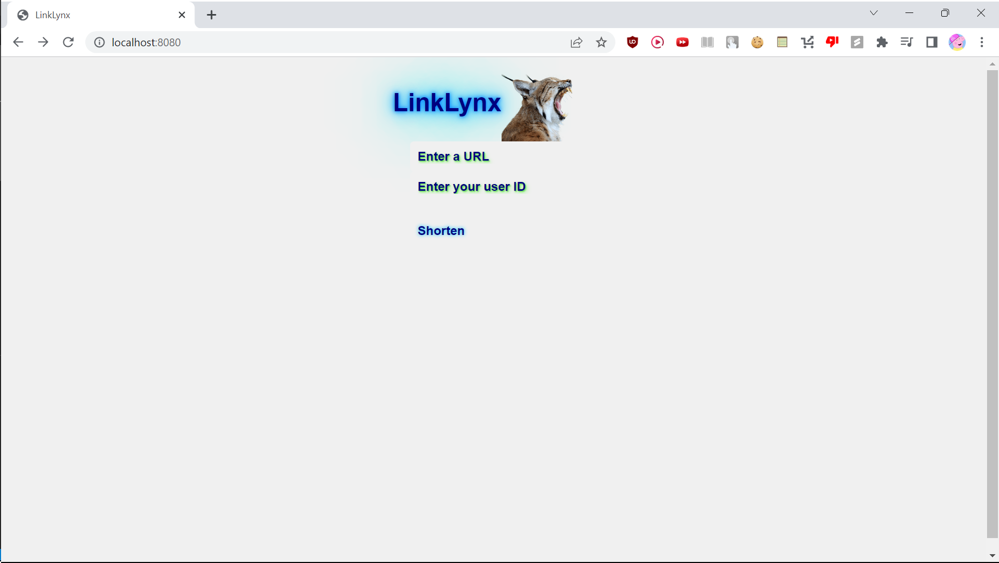
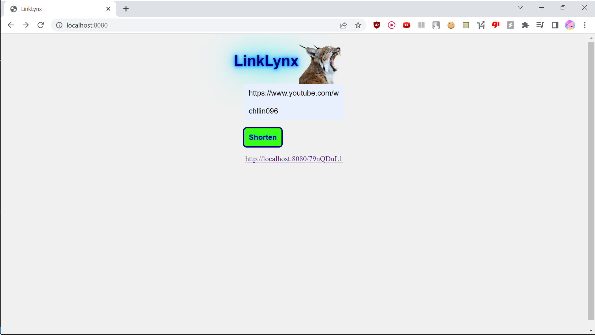

# Link Lynx

URL Shortener written in Go, using the Gin framework. 

Redis, Go (Gin), HTML/CSS/JS

<!--

  
  

-->

<!--
Next steps: 1) make it look better 3) implement side scrollbar window which saves all short URLs associated with the same username 4) login system based on username
-->
